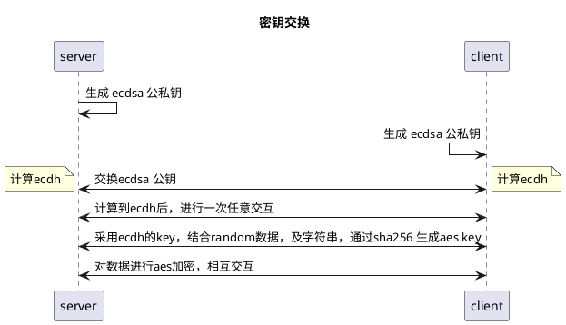

# overview


| 帧头|帧序号|设备端地址|命令字|长度|数据|校验位|
|---|---|---|---|---|---|---|
|1 byte |1 byte |4 bytes | 1 byte | 1 byte | N bytes |1 byte |

- 帧头

| bit 7 | bit 6-3 | bit 2-0 |
| ----- | ------- | ------- |
| secure bit | reserve | link mode, 0: 4G, 1: WIFI, 2: CABLE, 3: CLOUD|

- 命令字

| bit 7-6 | bit 5-0 |
| ------- | ------- |
| option code | property id |

- 长度: 从长度位后开始，之后的数据区长度，不包含校验位。 TODO: 暂时不考虑拼帧的状况。

```
print("header:\t{0:s}".format(self.header_line_mode[arrary_in[0]&0x3]))
print("seq:\t{0:d}".format(arrary_in[1]))
print("device id:\t{0}".format(arrary_in[2:6]))
print("property id:\t{0}".format(arrary_in[6]))
print("length:\t{0}".format(arrary_in[7]))
print("data:\t{0}".format(arrary_in[8:-1]))
print("crc:\t{0}".format(arrary_in[-1:]))
print("================================")
```


# option code (操作位)
| 二进制 | 含义 |
| ---- | ---- |
| 0b00 | get/upload |
| 0b01 | set |

# property id (属性id)

## Error 0x0 (get only)

## GPS 0x1 (get only)

## Temperature 0x2 (get only)

## Speed 0x3 (get only)

## HW Status 0x4 (get only)

## battery Power 0x5 (get only)

## Version 0x6 (get only)

## WIFI UUID/PASSWD 0x7 (get/set)

## linux command 0x8 (set)

## update signal 0x9 (set)

# Security

